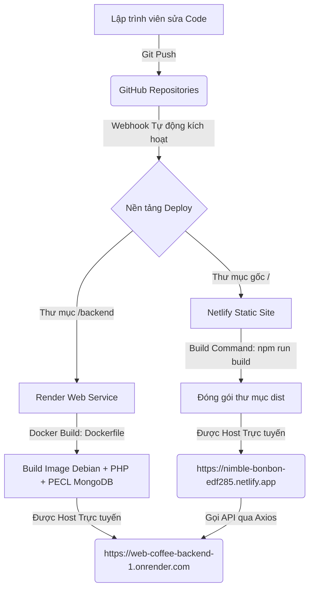

# BÁO CÁO KỸ THUẬT DỰ ÁN: LAB COFFEE & Trading Lounge
> **Tài liệu chuẩn kiến trúc hệ thống phục vụ tái sử dụng và mở rộng**

---

## 1. Tóm Tắt Dự Án
### Mục đích & Ý tưởng
**LAB COFFEE & Trading Lounge** là một hệ thống quản lý và tương tác dành cho mô hình quán cà phê hiện đại kết hợp khu giao dịch tài chính số (Trading Lounge). Dự án giải quyết sự giao thoa giữa trải nghiệm khách hàng tại thế giới thực và các hạ tầng kỹ thuật số thế hệ mới, cung cấp các khu vực bàn làm việc chuyên dụng cấu hình cao, bảo mật cao và tiện ích đặt bàn/gọi món trực tiếp thông qua nền tảng web.

### Quy mô dự án
Dự án được xây dựng dưới dạng mô hình kiến trúc **Full-Stack tách biệt (Decoupled Architecture)**:
* **Giao diện người dùng (Frontend):** Ứng dụng Single Page Application (SPA) viết bằng React (Vite) + TailwindCSS, tích hợp hệ thống định tuyến client-side và các tương tác 3D.
* **Giao diện quản trị (Admin Dashboard):** Bảng điều khiển quản lý thời gian thực tích hợp với quầy pha chế POS, quản lý kho hàng, ca trực, chương trình khuyến mãi và dữ liệu phân tích tài chính.
* **Hệ thống API (Backend):** Máy chủ API viết bằng PHP 8.2 kết nối đa cơ sở dữ liệu (MongoDB Atlas & MySQL Cloud), được đóng gói Docker hoàn chỉnh phục vụ triển khai tự động.

---

## 2. Cấu Trúc Kỹ Thuật (Folder Structure)

Kiến trúc thư mục được thiết kế sạch sẽ, tách biệt rõ ràng giữa logic giao diện người dùng và máy chủ dữ liệu:

```
D:/Web_coffe/
├── .env.production          # Biến môi trường frontend cho môi trường Production (API Render)
├── .gitignore               # Loại bỏ các thư mục build tĩnh, node_modules và thư mục backend
├── index.html               # Entry point HTML5 chính của ứng dụng React
├── package.json             # Khai báo các thư viện React, Vite, Axios, TailwindCSS
├── tailwind.config.js       # Tùy biến Design System (Material You 3, Glassmorphism)
├── vite.config.js           # Cấu hình bundler Vite
│
├── src/                     # Mã nguồn giao diện chính (React)
│   ├── main.jsx             # Điểm khởi chạy React, cấu hình Axios Interceptors toàn cục
│   ├── App.jsx              # Định tuyến router chính (Public, Admin Login, Dashboard)
│   ├── index.css            # Custom Design System, hiệu ứng ánh sáng (Spotlight, Radar)
│   │
│   ├── utils/               # Tiện ích bổ sung toàn hệ thống
│   │   ├── api.js           # Định cấu hình API Base URL và các fallback phát triển
│   │   └── audio.js         # Xử lý Web Audio API cho chuông thông báo đơn hàng mới
│   │
│   └── components/          # Các thành phần giao diện (React Components)
│       ├── Header.jsx       # Thanh điều hướng công cộng
│       ├── Footer.jsx       # Chân trang (Tích hợp thông tin đồng sở hữu)
│       ├── Hero.jsx         # Khu vực Banner chính (Sử dụng Glassmorphism và Typography hiện đại)
│       ├── Menu.jsx         # Khách hàng xem thực đơn và chọn món (Giỏ hàng động)
│       ├── AdminLogin.jsx   # Đăng nhập bảo mật trang quản trị
│       ├── AdminDashboard.jsx # Bảng điều khiển admin chính (POS, Inventory, Promotions)
│       └── TestConnection.jsx # Component hỗ trợ ping kiểm tra CORS và kết nối
│
└── backend/                 # Mã nguồn máy chủ và cơ sở dữ liệu (PHP API)
    ├── Dockerfile           # Kịch bản đóng gói container Debian + Apache + PHP 8.2 + PECL MongoDB
    ├── .dockerignore        # Loại bỏ thư mục vendor/ cục bộ để Docker tự động rebuild sạch sẽ
    ├── .gitignore           # Bỏ qua các tệp thư viện vendor/ và tệp môi trường cục bộ
    ├── composer.json        # Khai báo thư viện mongodb/mongodb (^2.0 tương thích PHP 8.2+)
    ├── index.php            # Trang kiểm tra kết nối API & Healthcheck (Netlify CORS)
    │
    ├── config/              # Tệp cấu hình cơ sở dữ liệu
    │   ├── db_connect.php   # Quản lý kết nối MongoDB Atlas (đọc từ biến môi trường MONGODB_URI)
    │   └── database.php     # Quản lý kết nối MySQL Cloud (đọc qua PDO)
    │
    └── admin/               # Nhóm API xử lý riêng cho chức năng quản trị viên
        ├── auth.php         # Cơ chế xác thực Session của Admin
        ├── login.php        # Nhận yêu cầu đăng nhập, so khớp mật khẩu mã hóa bcrypt
        ├── logout.php       # Hủy cookie session và chuyển hướng an toàn
        └── menu/            # APIs CRUD Menu (create, update, delete, restore, list)
```

---

## 3. Quy Trình DevOps & Triển Khai (Deployment Pipeline)

Quy trình hoạt động được tích hợp tự động (Continuous Integration / Continuous Deployment) theo sơ đồ sau:



### Chi tiết quá trình build trên các nền tảng:
1. **Render (Backend - Docker):**
   * Khi phát hiện push ở repo `Web_coffee_backend`, Render tải mã nguồn và đọc tệp `Dockerfile`.
   * Docker tải base image `php:8.2-apache`, tự động cập nhật hệ thống và biên dịch extension `mongodb` thông qua PECL, đồng thời kích hoạt `mod_rewrite`.
   * Docker chạy `composer install --ignore-platform-reqs` để tải thư viện `mongodb/mongodb:^2.0` (giúp tương thích hoàn toàn giữa PHP 8.2 và driver 2.0+).
   * Khởi chạy máy chủ Apache trên cổng `80` và cấp phát URL HTTPS động.
2. **Netlify (Frontend - React/Vite):**
   * Đọc repo `web_coffee_frontend_admin`, kéo toàn bộ file tĩnh (ngoại trừ thư mục `backend/` được bỏ qua bởi `.gitignore`).
   * Đọc biến môi trường `VITE_API_BASE_URL` và tiêm vào quá trình build.
   * Chạy `npm run build` để tối ưu hóa và xuất mã nguồn ra thư mục `/dist`.
   * Sử dụng file `public/_redirects` để điều hướng toàn bộ request `/*` về `index.html`, tránh lỗi 404 khi người dùng tải lại trang quản trị.

---

## 4. UX/UI & Các Hiệu Ứng Chính

Ứng dụng được thiết kế theo trường phái **Cyberpunk Minimalist** với các hiệu ứng động mượt mà giúp người dùng cảm giác như đang điều khiển một thiết bị tương lai:

| Hiệu ứng / Tính năng | Mô tả chi tiết | Cách thức tối ưu |
| :--- | :--- | :--- |
| **Glassmorphism** | Tấm kính mờ phản chiếu phần nền tối. Sử dụng thuộc tính `backdrop-filter: blur(20px)` và đường viền siêu mỏng `border-orange-200/10`. | Hạn chế tối đa lag trên điện thoại bằng cách tách layer rendering bằng `will-change`. |
| **Aura Mouse Trail** | Ánh sáng cam chạy theo con trỏ chuột trên màn hình máy tính (`CursorGlow.jsx`). | Sử dụng `requestAnimationFrame` và kỹ thuật bắt sự kiện ủy quyền (Event Delegation) để tránh quá tải bộ vi xử lý. |
| **POS Audio Alerts** | Tiếng beep thông báo khi có đơn hàng gọi món mới xuất hiện trên hệ thống. | Triển khai qua `Web Audio API` độc lập để âm thanh phát tức thì mà không cần load file âm thanh cồng kềnh. |
| **Countdown Timer** | Đồng hồ đếm ngược thời gian còn lại của Flash Sale theo thời gian thực (giây/phút/ngày). | Chạy bộ đếm interval động và tự động gửi request API cập nhật trạng thái `is_active = false` khi hết hạn. |

---

## 5. Công Nghệ & Ngôn Ngữ Sử Dụng

```
┌─────────────────────────────────────────────────────────────────────────┐
│                          DỰ ÁN LAB COFFEE                               │
├────────────────────┬────────────────────────────────────────────────────┤
│ Ngôn ngữ chính     │ PHP 8.2 (Backend)  // JavaScript ES6+ (Frontend)   │
├────────────────────┼────────────────────────────────────────────────────┤
│ Framework / Lib    │ React 18, Vite 5, TailwindCSS 3, MongoDB Driver 2.3│
├────────────────────┼────────────────────────────────────────────────────┤
│ Containerization   │ Docker, base image: php:8.2-apache                 │
├────────────────────┼────────────────────────────────────────────────────┤
│ Cloud Databases    │ MongoDB Atlas (NoSQL)  // PlanetScale (MySQL)      │
└────────────────────┴────────────────────────────────────────────────────┘
```

### Lý do lựa chọn công nghệ:
* **PHP 8.2 + Apache:** Cung cấp tốc độ khởi động cực nhanh trên môi trường Render Free Tier, dễ dàng cấu hình rewrite route thông qua file `.htaccess` mà không cần thiết lập proxy phức tạp.
* **MongoDB Altas NoSQL:** Phù hợp tuyệt đối với cấu trúc menu linh hoạt (sizes, toppings có giá trị thay đổi động) và lưu trữ lịch sử đơn hàng nhanh chóng, không bị ràng buộc bởi schema cố định.
* **React SPA (Vite):** Tốc độ biên dịch cực nhanh (HMR), thời gian tải trang ban đầu tối thiểu nhờ đóng gói chunk nhỏ, giúp tương tác Dashboard quản trị mượt mà như app desktop.

---

## 6. Hướng Dẫn Tái Sử Dụng (Reusability Template)

Để nhân bản hoặc phát triển một dự án mới dựa trên khuôn mẫu này, hãy thực hiện theo các bước chuẩn hóa sau:

### Bước 1: Khởi tạo cơ sở dữ liệu đám mây
1. Đăng ký tài khoản tại [MongoDB Atlas](https://www.mongodb.com/cloud/atlas).
2. Tạo một Database User và mật khẩu tương ứng.
3. Cấu hình **Network Access** là `0.0.0.0/0` (mở kết nối từ mọi nơi để Render có thể kết nối).
4. Lấy connection string dạng: `mongodb+srv://<user>:<password>@cluster.mongodb.net/?retryWrites=true&w=majority`

### Bước 2: Thiết lập Backend mới
1. Đóng gói thư mục `backend/` sang dự án mới.
2. Thiết lập cấu hình Composer trong thư mục `backend/` và chạy:
   ```bash
   composer update --ignore-platform-reqs
   ```
3. Deploy thư mục `backend/` lên **Render.com** (chọn môi trường **Docker**, Render sẽ tự đọc `Dockerfile`).
4. Cấu hình các biến môi trường tại Render tab **Environment**:
   * `MONGODB_URI` = *(Địa chỉ kết nối lấy từ bước 1)*
   * `MONGODB_DB_NAME` = `coffee_shop`

### Bước 3: Cấu hình Frontend mới
1. Tạo tệp `.env.production` trong thư mục gốc của frontend:
   ```env
   VITE_API_BASE_URL=https://your-new-backend-url.onrender.com
   ```
2. Cấu hình biến môi trường `VITE_API_BASE_URL` trên Netlify trỏ về URL Render vừa tạo ở Bước 2.
3. Tiến hành deploy frontend từ GitHub lên Netlify (cấu hình build command: `npm run build`, publish dir: `dist`).

---

## 7. Các Tối Ưu Hóa Kỹ Thuật Gần Đây

Dự án đã được nâng cấp và tối ưu hóa hệ thống toàn diện vào tháng 06/2026 với các cải tiến nổi bật:

### 1. Tối ưu hóa giao diện Sách thực đơn (Menu Book UI)
- **Hành động:** Loại bỏ hoàn toàn Spine overlay (đường cột đen dọc chính giữa) và Spine trong skeleton loading trong tệp [BookMenu.jsx](file:///d:/Web_coffe/src/components/Menu/BookMenu.jsx).
- **Mục đích:** Quyển sách menu khi mở ra trông liền mạch, phẳng phiu và hiện đại hơn theo đúng tinh thần Cyberpunk Minimalist, loại bỏ cảm giác chia cắt trang nặng nề.

### 2. Tối ưu hóa hiệu năng và dung lượng bundle Frontend (Code Splitting)
- **Hành động:** Sử dụng cấu hình `manualChunks` của Rollup trong [vite.config.js](file:///d:/Web_coffe/vite.config.js) để tách biệt các thư viện lớn (`react`, `react-dom`, `react-router-dom`, `axios`) thành tệp `vendor` độc lập.
- **Mục đích:** Khắc phục cảnh báo dung lượng chunk lớn của Vite (>500kB), tối ưu hóa tốc độ tải trang ban đầu (Initial Page Load) cho khách hàng và giảm thiểu băng thông tiêu thụ.

### 3. Tối ưu hóa cấu trúc Git & Quy trình DevOps Backend
- **Hành động:** Thiết lập tệp [.gitignore](file:///d:/Web_coffe/backend/.gitignore) cho backend và dừng theo dõi thư mục `vendor/` trên Git.
- **Mục đích:** Giảm thiểu tuyệt đối dung lượng của kho lưu trữ backend trên GitHub, giúp quá trình commit/push diễn ra tức thì. Render sẽ tự động chạy sạch sẽ `composer install` trong môi trường Docker tách biệt khi deploy.

### 4. Tối ưu hóa cơ chế kiểm soát CORS động
- **Hành động:** Nâng cấp tất cả các API PHP để kiểm tra động tiêu đề request `HTTP_ORIGIN` đối chiếu với một danh sách các nguồn được whitelist (`localhost:5173`, Netlify) thay vì cấu hình cứng duy nhất một nguồn.
- **Mục đích:** Cho phép hệ thống hoạt động ổn định và bảo mật cùng một lúc trên cả môi trường phát triển cục bộ và môi trường triển khai thực tế (Production) mà không cần can thiệp thủ công vào mã nguồn.

---

Copyright (c) 2026 Hiếu Đỗ, Thông Trần, JaThong. All rights reserved.

