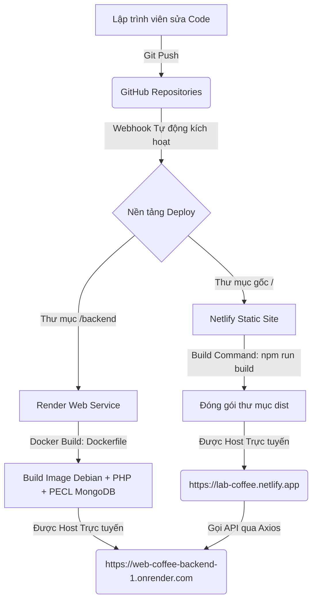

# PHÂN TÍCH TOÀN BỘ CẤU TRÚC TRANG WEB LAB COFFEE & TRADING LOUNGE

Tài liệu này phân tích chi tiết cấu trúc mã nguồn, công nghệ sử dụng, thiết kế giao diện (UI), trải nghiệm người dùng (UX) và bố cục trình bày của dự án **LAB COFFEE & Trading Lounge**.

---

## 1. Công Nghệ Sử Dụng (Tech Stack)

Dự án được xây dựng dưới dạng mô hình kiến trúc **Full-Stack tách biệt (Decoupled Architecture)** nhằm tối ưu hóa tải trang, bảo mật và khả năng mở rộng.

### Front-End (Giao diện người dùng)
- **Core:** React (v18.3.1) chạy trên nền Vite (v5.4.11) giúp tăng tốc độ biên dịch (HMR) và tải trang ban đầu cực nhanh.
- **Styling:** Tailwind CSS (v3.4.19), PostCSS, và Autoprefixer. Giao diện thiết kế theo hệ thống lưới đáp ứng (Responsive Grid) thích ứng hoàn hảo trên mọi thiết bị di động, tablet và desktop.
- **Tối ưu hóa tài nguyên (Code Splitting):** Cấu hình phân mảnh Rollup `manualChunks` giúp cô lập các thư viện lớn (`react`, `react-dom`, `react-router-dom`, `axios`) thành tệp tin `vendor` riêng biệt dưới 300KB, tăng tốc độ tải trang ban đầu.
- **Hiệu ứng & Hoạt họa (Visual Effects):**
  - **page-flip & react-pageflip (v0.0.3):** Tạo hiệu ứng lật sách 3D mô phỏng thực tế cho quyển sách thực đơn.
  - **CursorGlow (Aura Mouse Trail):** Ánh sáng neon chạy theo con trỏ chuột sử dụng `requestAnimationFrame` và kỹ thuật ủy quyền sự kiện (Event Delegation) để tránh quá tải bộ vi xử lý.
  - **Web Audio API:** Phát tiếng beep thông báo tức thì khi có đơn đặt món mới xuất hiện trên hệ thống quản trị POS mà không cần tải các tệp âm thanh cồng kềnh.

### Back-End & Bảo Mật (Máy chủ)
- **Ngôn ngữ & Máy chủ:** PHP 8.2 kết hợp máy chủ Apache, được đóng gói container Docker hoàn chỉnh (`php:8.2-apache` trên nền Debian) để triển khai tự động trên Render.
- **Cơ chế Bảo mật:**
  - **Session Verification & Regeneration:** Bảo vệ cookie phiên làm việc, chống các cuộc tấn công Session Fixation bằng cách tự động tạo lại mã định danh khi đăng nhập thành công (`session_regenerate_id`).
  - **SQL/MySQL PDO Prepared Statements:** Chống triệt để lỗ hổng SQL Injection bằng cách tách biệt dữ liệu đầu vào và cấu trúc lệnh truy vấn.
  - **Kiểm soát CORS động:** Hệ thống tự động kiểm tra `HTTP_ORIGIN` và phản hồi động cho phép truy cập từ các địa chỉ whitelisted (`http://localhost:5173`, `https://lab-coffee.netlify.app`, `https://nimble-bonbon-edf285.netlify.app`), đồng thời chặn các truy cập trái phép.
  - **mod_rewrite (.htaccess):** Cấu hình điều phối API mượt mà và ẩn định dạng đuôi tệp tin.

### Cơ sở dữ liệu (Database)
- **MongoDB Atlas (NoSQL):** Lưu trữ linh hoạt thông tin danh mục thực đơn (sizes, toppings), lịch sử đặt món và dữ liệu phi cấu trúc có tốc độ truy xuất cao.
- **MySQL Cloud (SQL):** Lưu trữ tài khoản quản trị viên và các số liệu phân tích tài chính có quan hệ chặt chẽ thông qua lớp kết nối PDO bảo mật.

---

## 2. Cấu Trúc Thư Mục Dự Án (Project Folder Structure)

Kiến trúc thư mục được phân chia sạch sẽ, độc lập giữa giao diện người dùng và máy chủ dữ liệu:

```
D:/Web_coffe/
├── .env.production             # Cấu hình biến môi trường Frontend cho Production (Render API)
├── .gitignore                  # Bỏ qua các thư mục build tĩnh (dist/), node_modules/ và thư mục backend/
├── index.html                  # Entry point HTML5 chính của ứng dụng React
├── package.json                # Định nghĩa các thư viện phụ thuộc của Front-End
├── tailwind.config.js          # Tùy biến Design System (Material You 3, Glassmorphism)
├── vite.config.js              # Cấu hình Rollup Code-Splitting và Vite Bundler
│
├── src/                        # Thư mục mã nguồn chính của Front-End
│   ├── main.jsx                # Điểm khởi chạy React DOM, cấu hình Axios Interceptors toàn cục
│   ├── App.jsx                 # Bộ định tuyến router (Public Pages, Admin Login, Dashboard)
│   ├── index.css               # Tệp styles tùy chỉnh (Glassmorphism, Neon Glows, Shimmer...)
│   │
│   ├── utils/                  # Tiện ích bổ sung toàn hệ thống
│   │   ├── api.js              # Cấu hình URL API Base động
│   │   └── audio.js            # Xử lý âm thanh Web Audio API thông báo đơn hàng
│   │
│   └── components/             # Các khối thành phần giao diện (React Components)
│       ├── Header.jsx          # Thanh điều hướng công cộng
│       ├── Footer.jsx          # Chân trang tích hợp thông tin bản quyền và đồng sở hữu
│       ├── Hero.jsx            # Khối đầu trang (Cyberpunk Banner & Radar locator)
│       ├── Menu.jsx            # Giao diện xem thực đơn dạng lưới dự phòng cho khách hàng
│       ├── AdminLogin.jsx      # Giao diện đăng nhập bảo mật của Admin
│       ├── AdminDashboard.jsx  # Bảng điều khiển quản trị (POS, Inventory, HR, Promotions)
│       ├── TestConnection.jsx  # Công cụ kiểm tra kết nối API & CORS
│       │
│       ├── Menu/               # Nhóm thành phần sách thực đơn 3D
│       │   ├── BookMenu.jsx    # Component lật sách 3D chính (đã loại bỏ Spine đen ở giữa)
│       │   ├── HTMLFlipBook.jsx # Trình wrapper React cho thư viện page-flip
│       │   ├── MenuItem.jsx    # Chi tiết hiển thị của từng món nước
│       │   └── MenuSection.jsx # Khung bao ngoài điều phối Sách thực đơn và Khay gọi món
│       │
│       ├── Reservations/       # Nhóm thành phần đặt bàn & Terminals
│       └── TradingLounge/      # Phân khu giao dịch tài chính số
│
└── backend/                    # Máy chủ API PHP & Database (Repository biệt lập)
    ├── Dockerfile              # Kịch bản đóng gói container Debian + Apache + PHP + PECL MongoDB
    ├── .dockerignore           # Loại bỏ vendor/ và log để Docker tự rebuild sạch sẽ trên Render
    ├── .gitignore              # Loại bỏ vendor/ và tệp môi trường khỏi Git tracking
    ├── composer.json           # Khai báo thư viện mongodb/mongodb (^2.0)
    ├── index.php               # Điểm Healthcheck & CORS Test cho cổng Netlify
    │
    ├── config/                 # Thư mục cấu hình cơ sở dữ liệu
    │   ├── db_connect.php      # Quản lý kết nối MongoDB Atlas (đọc từ biến MONGODB_URI)
    │   └── database.php        # Quản lý kết nối MySQL Cloud (đọc qua PDO)
    │
    └── admin/                  # Các endpoint API quản trị viên
        ├── auth.php            # Cơ chế xác thực Session admin
        ├── login.php           # Nhận thông tin đăng nhập, đối chiếu mật khẩu mã hóa bcrypt
        ├── logout.php          # Hủy cookie session và đăng xuất an toàn
        └── menu/               # APIs CRUD sản phẩm (create, update, delete, restore, list)
```

---

## 3. Thiết Kế Giao Diện (UI) & Trải Nghiệm Người Dùng (UX)

Dự án sở hữu phong cách thiết kế **Cyberpunk Minimalist** độc đáo, kết hợp giữa sự bí ẩn của không gian số và tính sang trọng của một phòng giao dịch tài chính.

### Ngôn Ngữ Thiết Kế & Mỹ Thuật (UI)
- **Tone màu chủ đạo:** Sử dụng màu nền tối sâu thẳm (`#0c0f0f` và `#121616`) kết hợp với màu cam đồng ấm áp (`#ffb77b` / `#bf953f`) tạo điểm nhấn ánh sáng tinh tế đại diện cho chất cà phê và ánh nến.
- **Typography:** Kiểu chữ không chân hiện đại (Space Grotesk, Montserrat, Orbitron) được áp dụng đồng bộ, mang lại cảm giác công nghệ cao và chuyên nghiệp.
- **Glassmorphism (Kính mờ):** Các khối hiển thị (`glass-panel`, `glass-card`) được thiết kế với độ mờ hậu cảnh cao (`backdrop-filter: blur(20px)`) kết hợp đường viền siêu mỏng phản chiếu ánh sáng nhẹ (`border-orange-200/10`) tạo cảm giác chiều sâu 3D vô cực.
- **Hiệu ứng Holographic & Radar:** Vòng tròn định vị nhấp nháy phát sáng (`radar-pulse-ring`) và các chuyển động xoay tròn tinh tế (`animate-radar-sweep`) ở các biểu đồ tài chính.

### Trải Nghiệm Người Dùng Độc Đáo (UX)
- **Sách thực đơn kỹ thuật số 3D (Flat Book Experience):** Sách thực đơn cho phép lật trang 3D mượt mà. Cột đen phân cách ở giữa (Spine overlay) đã được loại bỏ hoàn toàn để tạo ra trải nghiệm đọc liền mạch, phẳng phiu, sang trọng và không bị gián đoạn thị giác.
- **Khay gọi món thông minh (Order Tray):** Khay chứa món nước nổi góc dưới màn hình giúp khách hàng dễ dàng theo dõi số lượng, thay đổi số lượng trực tiếp và tính tổng số tiền theo thời gian thực trước khi gửi lệnh gọi món.
- **Âm thanh thông báo POS thời gian thực:** Hỗ trợ âm thanh phản hồi ngay lập tức cho nhân viên pha chế khi có đơn đặt món mới, giúp tăng tốc hiệu suất phục vụ.

---

## 4. Bố Cục Trình Bày Trên Trang Web (Web Layout)

Giao diện Single Page Application (SPA) của khách hàng được chia thành các phân đoạn cuốn hút từ trên xuống dưới:

1. **Thanh điều hướng (Header):** Thiết kế kính mờ bám dính trên cùng (Sticky Glassmorphic Header). Tự động thay đổi độ mờ và kích thước khi người dùng cuộn chuột để giữ khoảng không gian hiển thị rộng rãi.
2. **Khu vực giới thiệu (Hero Section):** Banner lớn thiết kế tối giản, tiêu đề chữ nổi ánh kim đại diện cho tinh thần quán, kết hợp vòng sáng radar quét định vị.
3. **Phân khu Sách thực đơn (Menu Section):** Trung tâm trải nghiệm khách hàng với quyển sách thực đơn 3D chuyển động mượt mà kết hợp khay gọi món bay nổi.
4. **Không gian Giao dịch (Trading Lounge):** Trình bày các bàn làm việc chuyên dụng cấu hình cao, bảo mật cao và các dịch vụ bổ trợ cho nhà giao dịch số.
5. **Đăng ký chỗ làm việc (Reservations):** Giao diện bản đồ sơ đồ tầng (Floor Map) trực quan. Cho phép khách chọn trực tiếp vị trí bàn (Bàn 01 - Bàn 05), hiển thị trạng thái bàn đang trống hay có người (`occupied`) và chọn khung giờ hoạt động.
6. **Ý kiến khách hàng (Testimonials):** Thiết kế dạng lưới thẻ. Khi rê chuột vào một thẻ bất kỳ, các thẻ còn lại sẽ tự động mờ đi (Focus Mode) kết hợp hiệu ứng tia laser quét ngang tạo điểm nhấn công nghệ.
7. **Form liên hệ (Contact Section):** Tích hợp thông tin liên lạc và bản đồ Google Maps phiên bản lọc màu tối (Dark Mode Map) đồng bộ mỹ thuật toàn trang.
8. **Chân trang (Footer):** Hiển thị các liên kết chính thống, chính sách bảo mật và thông tin bản quyền được bảo hộ.

---

## 5. Quy Trình DevOps & Triển Khai (Deployment Pipeline)

Quy trình hoạt động được tích hợp tự động hóa hoàn toàn (CI/CD) thông qua Git Webhooks:



1. **Render (Backend - Docker):** Khi phát hiện push ở repo `web_coffee_backend`, Render tự tải mã nguồn và đọc tệp `Dockerfile`. Do thư mục `vendor/` được bỏ qua bởi `.gitignore`, Docker tiến hành build sạch sẽ và chạy `composer install` để đảm bảo không bị lỗi sai khác phiên bản thư viện.
2. **Netlify (Frontend - React/Vite):** Tự động kéo mã nguồn từ repo `web_coffee_frontend_admin` khi có push, tiêm biến môi trường `VITE_API_BASE_URL` và thực hiện `npm run build` để xuất gói mã nguồn tối ưu vào thư mục `/dist`.

---

```javascript
/**
 * Copyright (c) 2026 JAThong, Trần Hoàng Thông và Đỗ Lê Trọng Hiếu. All rights reserved.
 *
 * Developed by:
 * - Trần Hoàng Thông
 * - Đỗ Lê Trọng Hiếu
 */
```
